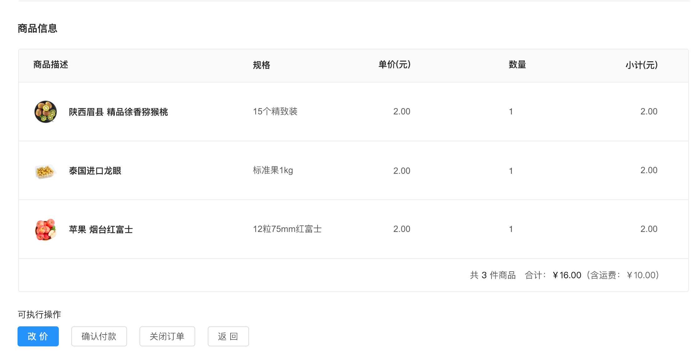
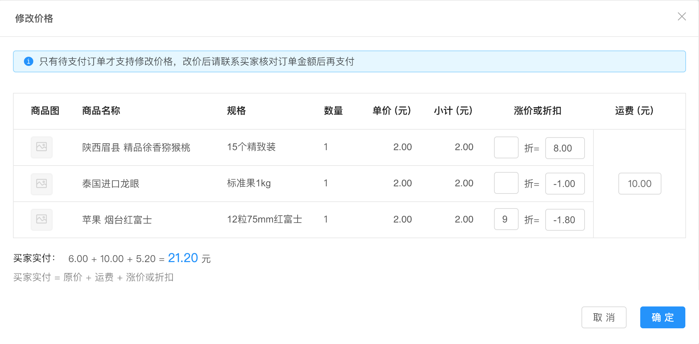
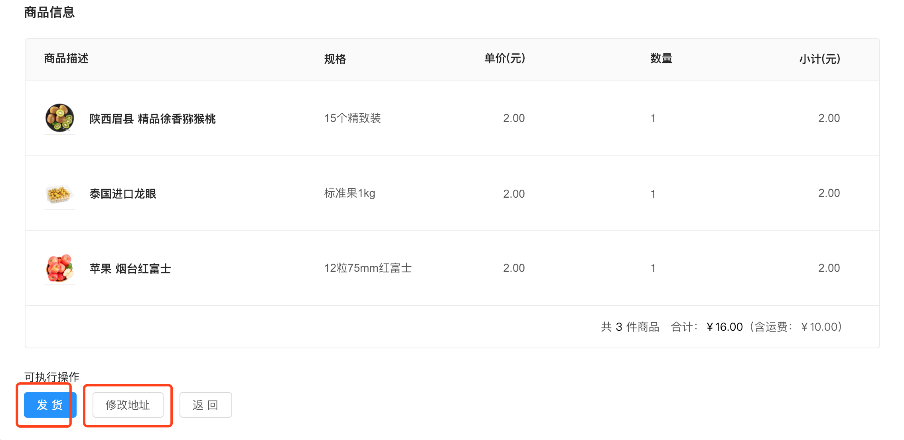
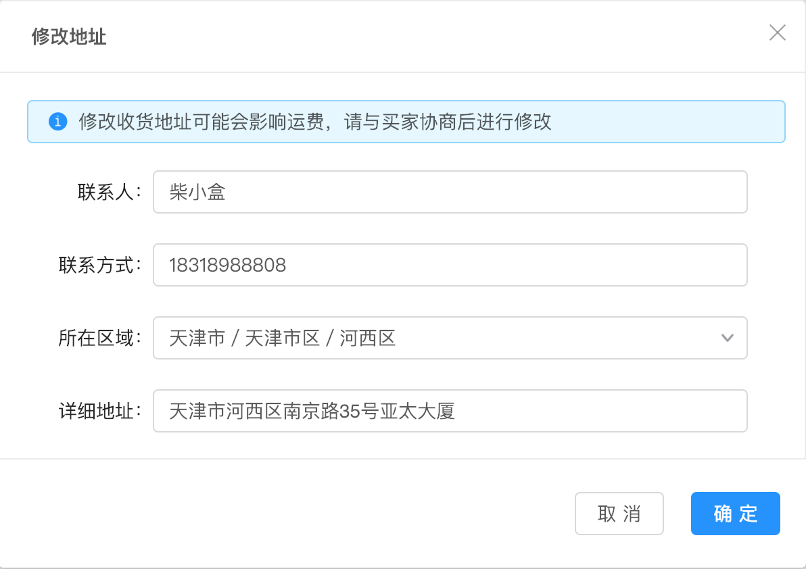
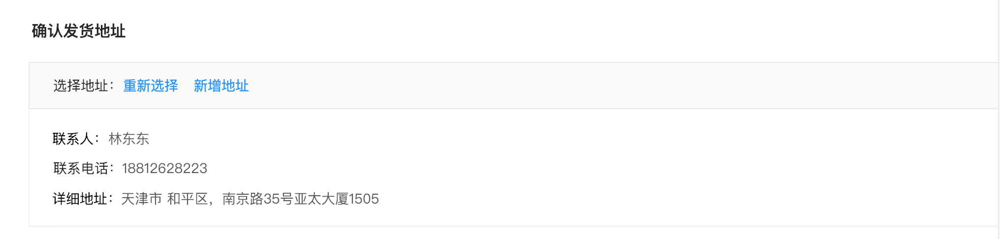
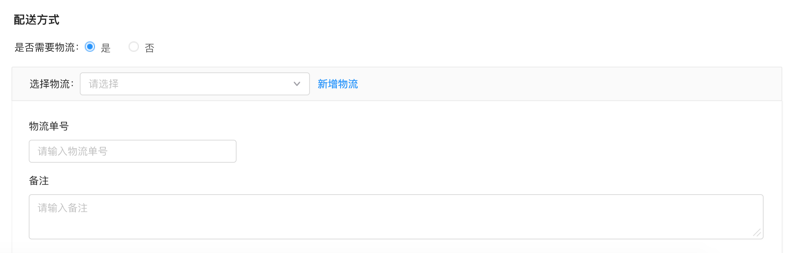
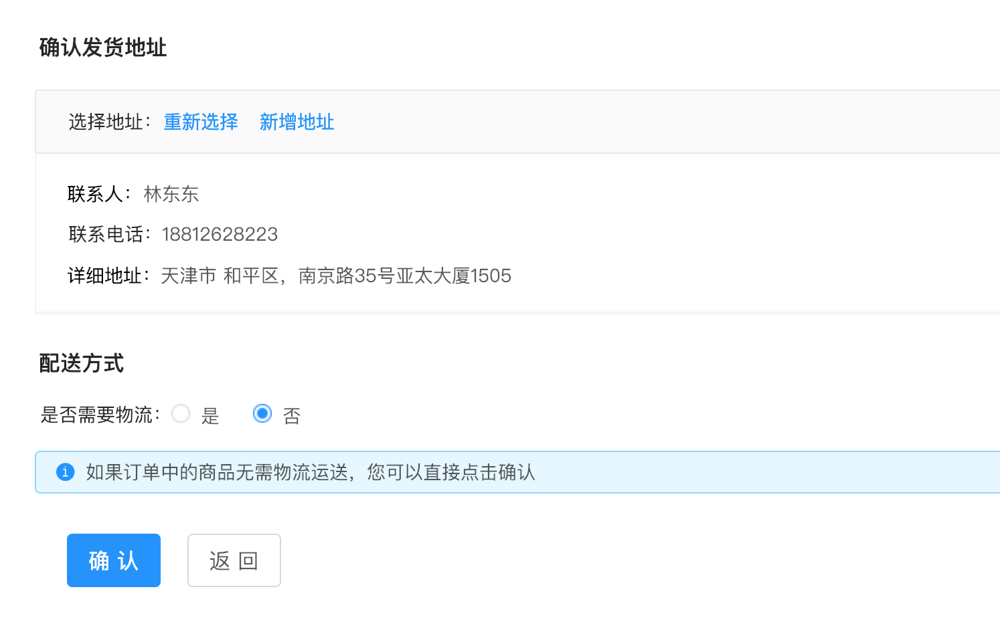

# 订单

#### 订单详情

1、订单详情可以查看订单基本信息，收货信息，其他信息，商品信息，

如图所示：

 

可以执行操作，更改商品价格，可执行操作主要取决于订单状态，当前状态是属于待付款状态，所以可以进行改价。

如图所示：

修改价格，有订单的基本信息，包括运费都可以进行修改，

改价须知：

待付款的订单可以支持修改价格

分销订单不支持修改价格

如图所示：

2、待发货状态下基本信息，可执行操作，发货，修改发货地址，

如图所示：

修改地址须知：

待发货的订单，收货地址支持修改。

理论上来讲，待付款的订单买家可以主动取消订单重新下单来修改地址，如果涉及到活动商品由于比较难抢的情况，买家不愿意取消订单再重新下单，那就只能由付完款后联系卖家修改地址。有赞的待付款情况下也可以由商家修改地址，个人认为是给商家增加成本。

拼团订单、分销订单不支持修改地址

修改地址影响运费的情况：

（特殊说明：影响运费但不影响平台中交易的实际付款金额，差价需商家和买家进行协调解决）

a.一件商品天津地区包邮，其他地区运费10元，买家先拍了天津的地址，然后告诉商家想换成新疆的地址，那商家肯定不同意，这个时候订单金额已经生成，该怎么和买家收取10元的运费？

b.上面的情况反一下，该怎么给买家退10元的运费？

解决办法：

a.发一个10元的虚拟商品链接让买家买下来再发货

b.线下红包转账等（等交易完成后再发）

如果买家申请退款：

a.原商品和虚拟商品一起退即可

b.退款退货、仅退款已收到货情况下，联系买家输入退款金额时少输入10元。仅退款未收到货情况下，由于金额不能修改，只能退全款，所以商家之前补给买家的红包就有作用了，就是为避免这种情况，也就是交易取消的情况，不给买家发那10元红包即可

3、发货地址确认，可以重新选择地址，或者新增地址，重新选择地址，是针对当用户添加了多个地址进行选择。

如图说示：

4、是否需要物流配送，选择物流，新增地址，在设置页面中进行添加物流地址，

确定发货地址，不需要物流，点击否

如图所示：

