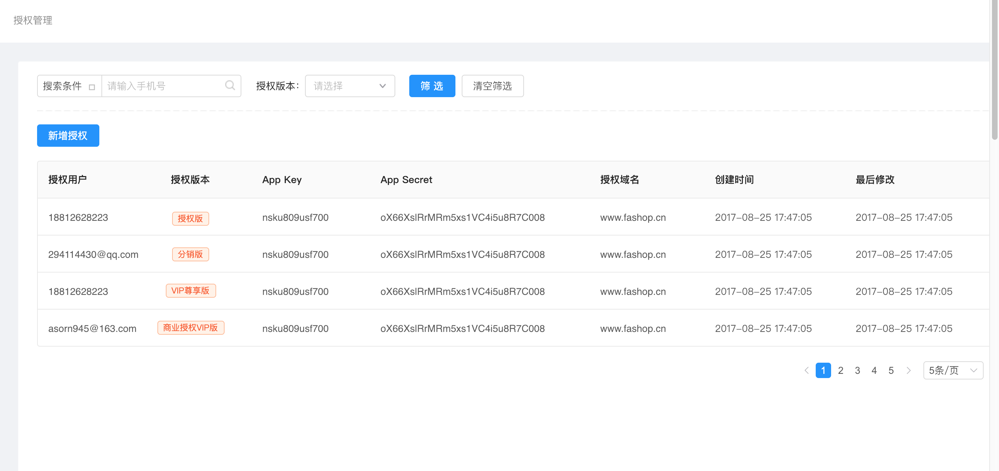
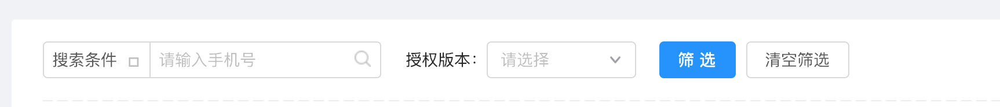
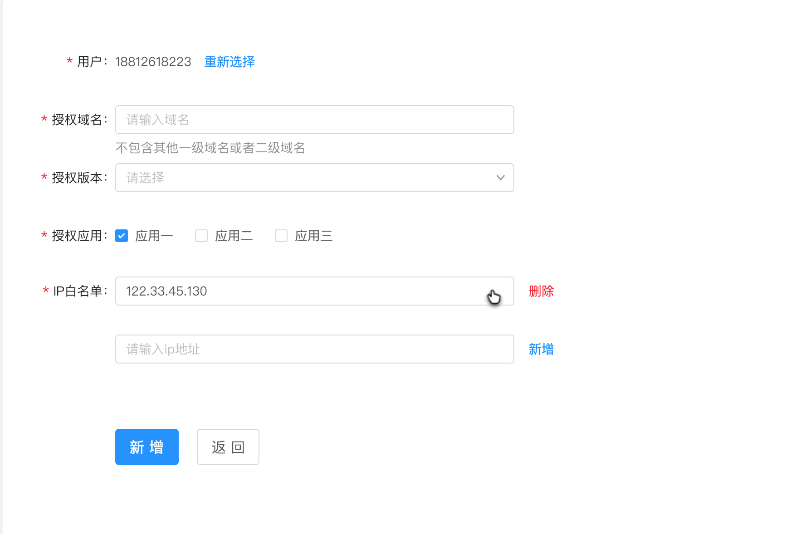
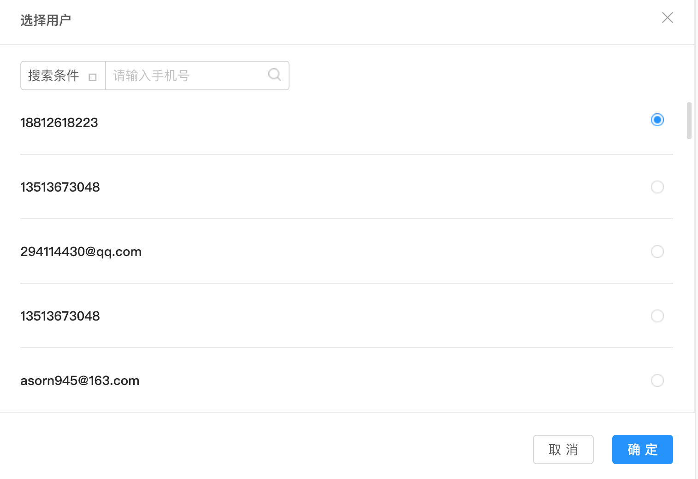
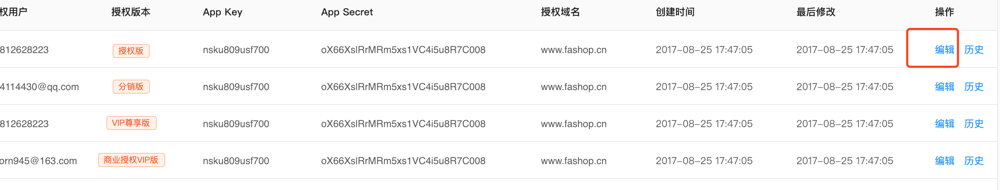
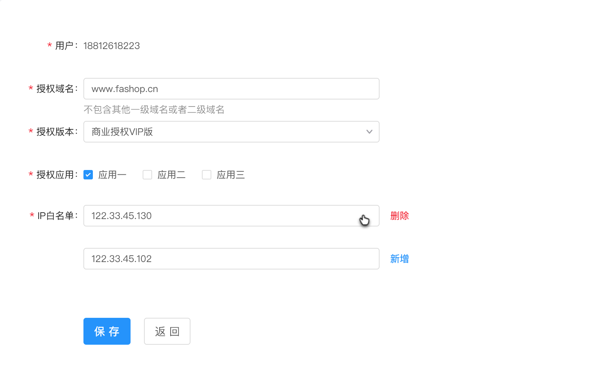
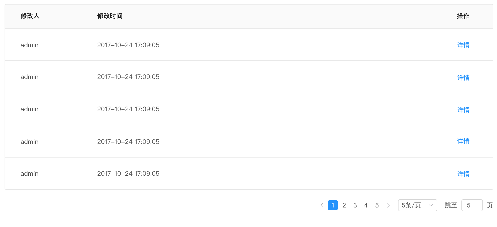

# 主系统后台

### 授权管理

1、授权管理，是对用户针对不同的级别版本进行授权，每个级别所对应的应用功能也是不同。

2、筛选，根据用户名称，授权版本，快速搜索用户信息。

3、新增授权，选择用户进行授权，选择对应版本，选择授权应用管理。

4，重新选择用户

5、编辑已授权用户资料，，可对其进行相对应调整。

6、历史记录可以查看修改记录，包括谁进行修改，修改时间是什么，详情可查看修改了什么内容

