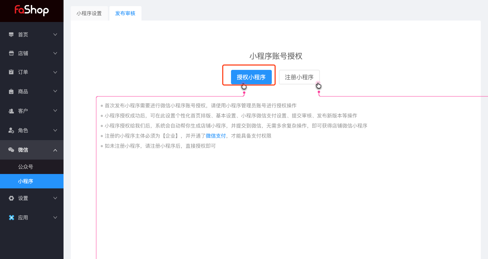
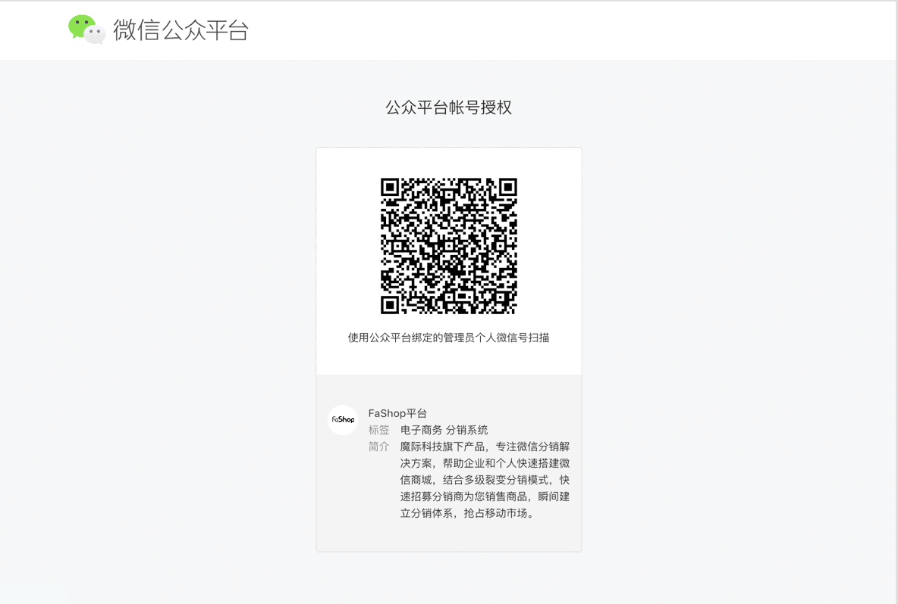
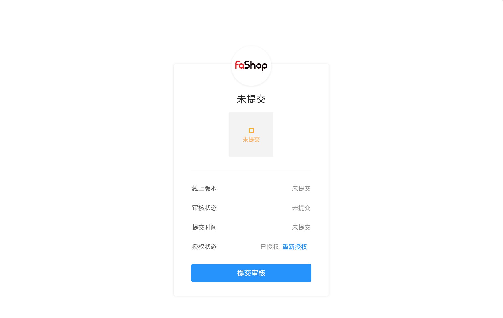

# 微信
## 小程序发布审核

<h6>小程序账号授权需注意：</h6>

1、首次发布小程序需要进行授权，请使用管理员账号进行授权操作

2、小程序授权成功后，可以设置个性化首页排版，基本设置，小程序支付设置，提交审核，发布新版本

3、小程序授权后，系统会自动帮你生成店铺小程序，并提交到微信，即可获得店铺小程序微信

4、注册的小程序主体为【企业】，并开通微信支付，才具备支付权限

5、如未注册小程序，请注册小程序后，直接授权即可



公众平台授权,，请使用管理员账号进行授权



<h6>版本提交状态：</h6>
```html
线上版本、审核状态、提交时间、是否授权
```

