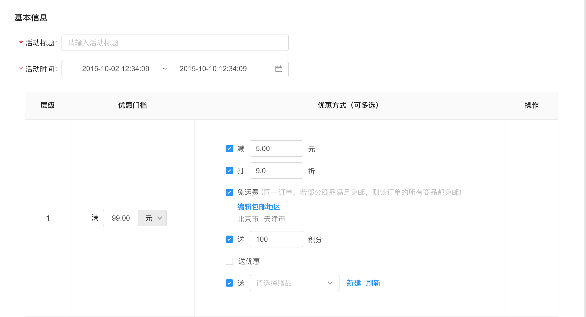
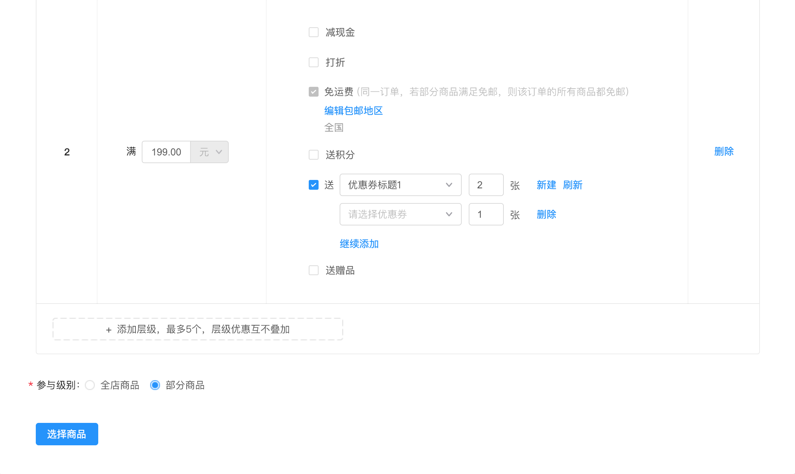
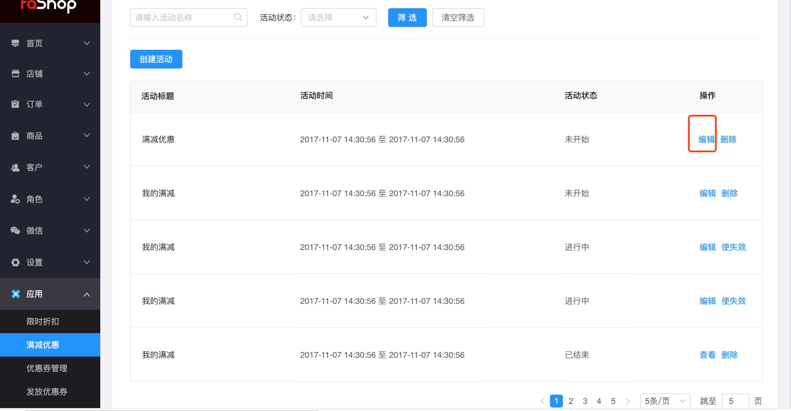
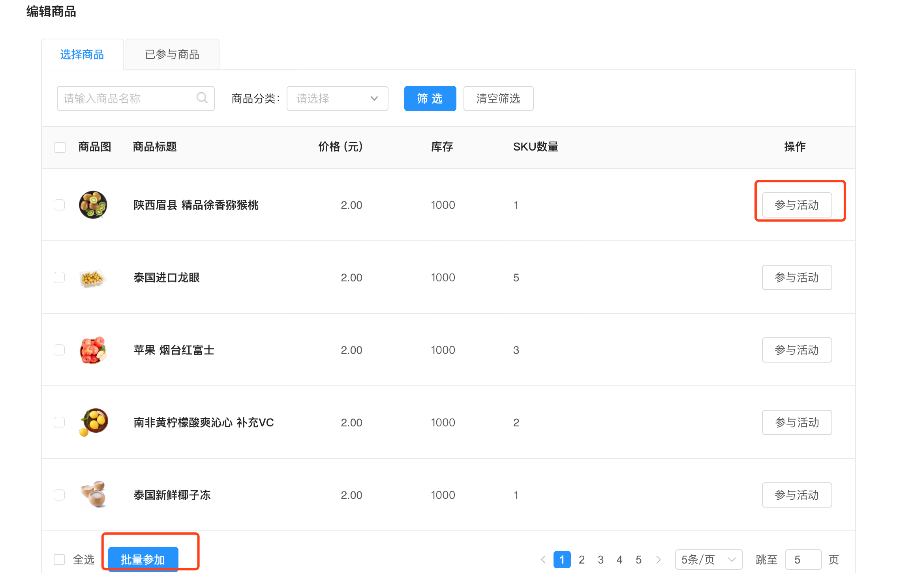
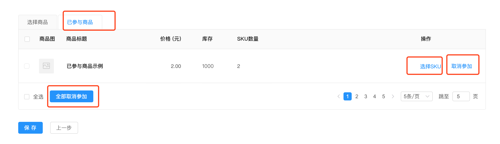

# 应用

#### 满减优惠

<h6>根据筛选活动，活动状态进行筛选对应活动</h6>

创建活动，填写活动标题，活动时间，选择优惠门槛，优惠层级最多5个，层级优惠不增加。

注意打折和减现金不能同时存在，赠品只能选一件,包邮地区可以比上一级多设置地区,参与级别为全店时，没有选择商品的过程

操作为发布活动。

选择不同的优惠方式，这里支持多选，商品参与级别也可控，可以选择部分商品，还是全部商品。

<h6>编辑商品</h6>

编辑商品，可对商品进行选择商品是否参与活动，可以批量对商品进行操作参与活动。

<h6>已选商品</h6>

已选商品，可对商品选择sku，或对当前已参与商品进行取消参加活动，还有全部取消参加活动操作。

<h6>选择sku</h6>

