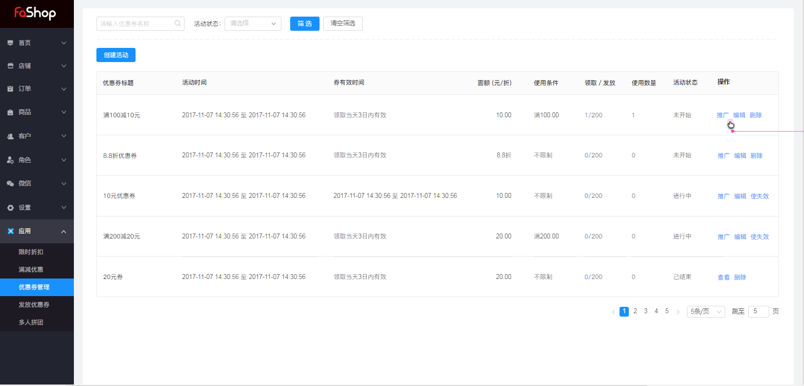
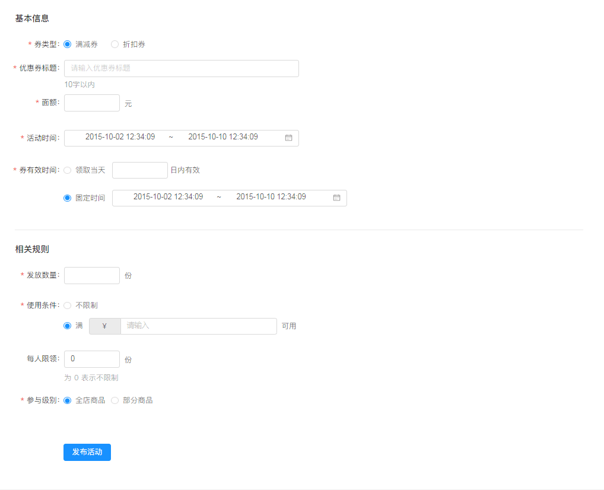
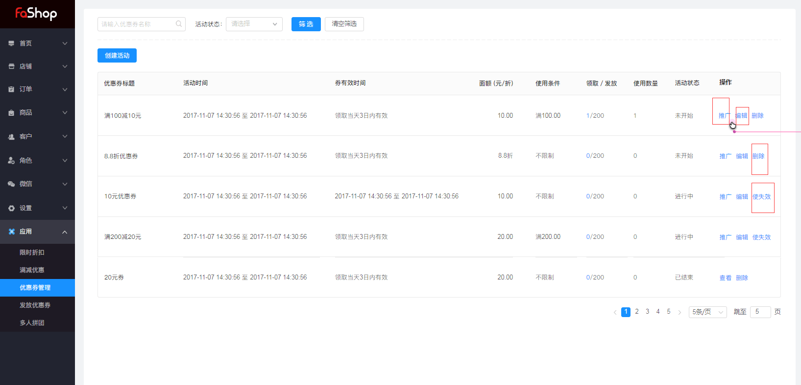

# 应用

#### 优惠券管理

<h6>根据筛选活动，活动状态进行筛选对应活动</h6>

<h6>创建活动</h6>

选择券类型，是满减券，还是折扣券

填写标题，券面额，活动时间，券有效时间，

相关规则：券的数量，使用条件，每人限领，参与级别，是全店商品，还是部分商品。

<h6>优惠券操作</h6>

注意：优惠券创建完编辑时只能编辑标题和发放数量

二维码进行推广，可直接复制二位链接用网站打开，或手机直接扫码查看。

删除，可删除当前优惠券，

使失效，可对优惠券进行失效操作。

