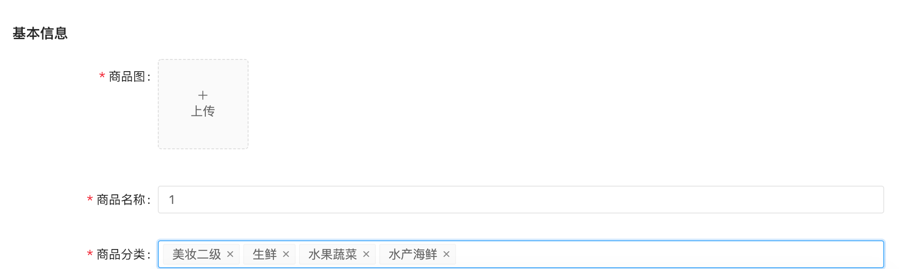
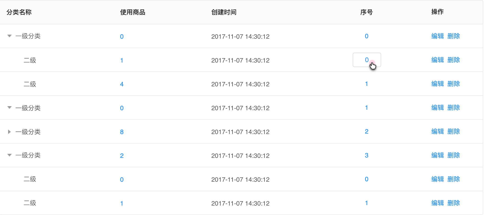
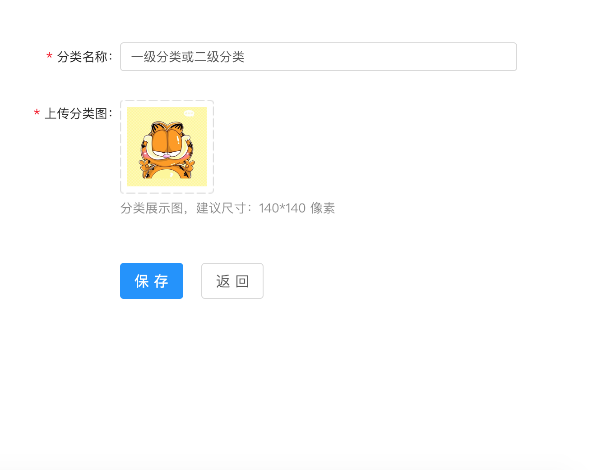

# 商品

### 分类管理

1、添加分类，全部展开，全部折叠

注：1.全部展开，一级分类下面二级分类全部展开罗列出来，全部折叠，只显示一级分类，二级分类全部折叠起                          

​        来。

​        2.根据序号进行排序，一级分类和二级分类是单独的，且二级不可超过一级

如图所示：

2、添加分类

注：1.分类可以只添加一级，也可以在添加的时候选择上级分类直接成为二级分类

​        2.由于商品使用分类无分类等级限制，因此每个分类（一级+二级）的使用商品数量是不等的，会出现如：

​        水果（0）= 苹果（3）+香蕉（5）

3、编辑分类

如图所示：

