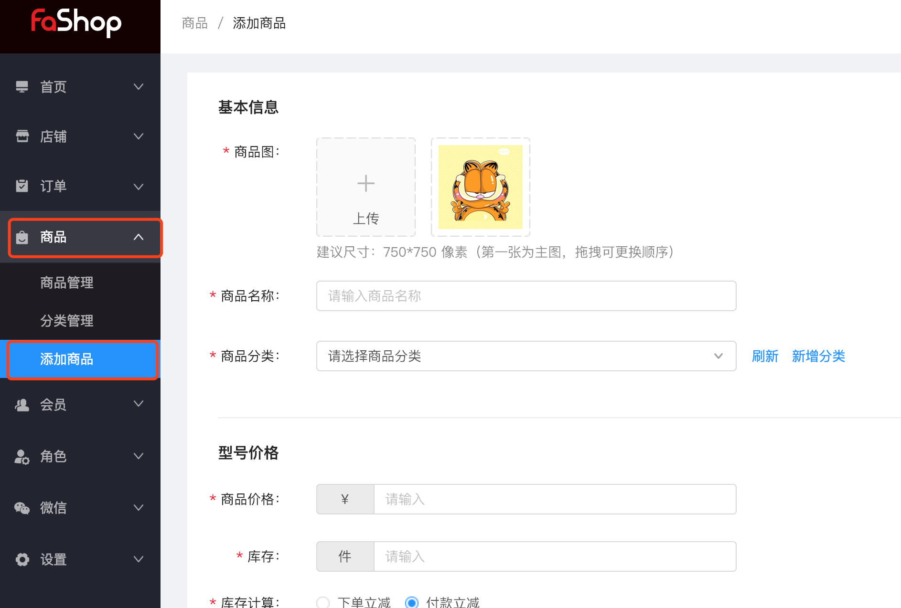
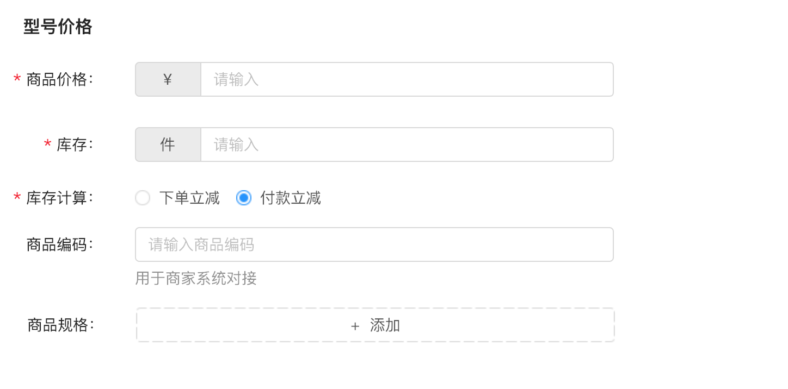
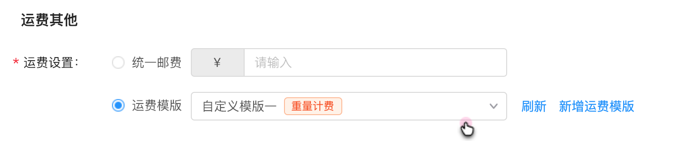
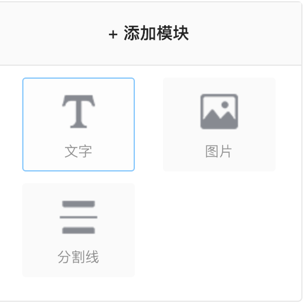

# 商品

#### 商品添加

**功能路径**

商家店铺后台，商品-添加商品，进行添加商品

如图所示；

**操作流程**

1、上传商品图片，输入商品名称，选择商品分类

注：商品分类是可以进行多选，而且不区分一级二级等级关系，即可同时选择一级分类和一级分类下的某一个或多个二级分类。

如图所示：

2、商品规格，库存，库存计算选择对应的计算方式，商品编码（商家系统进行编码对接），商品规格，根据商品的型号进行选择。

如图所示：

3、运费选择，统一运费，运费模版，开售时间选择

注：运费模版选择重量计费时，商品型号价格里多出一行重量输入

如图所示：

!

4、商品详情，根据商品图和标题自动生成

注：可以添加模块（文字，图，分割线）

如图所示：

5、	上架出售，放入仓库