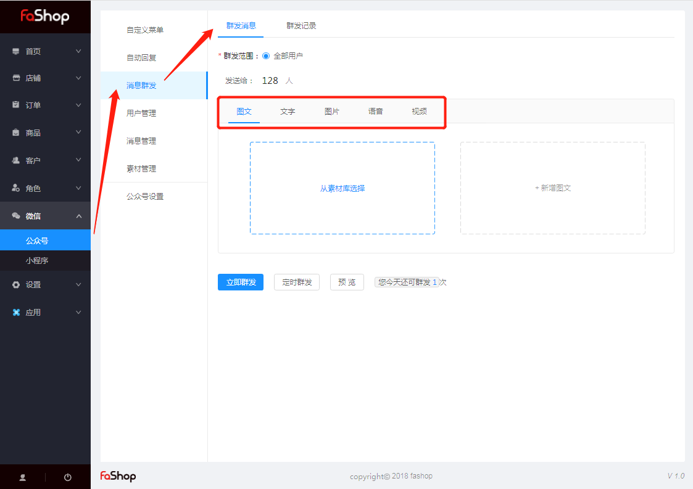
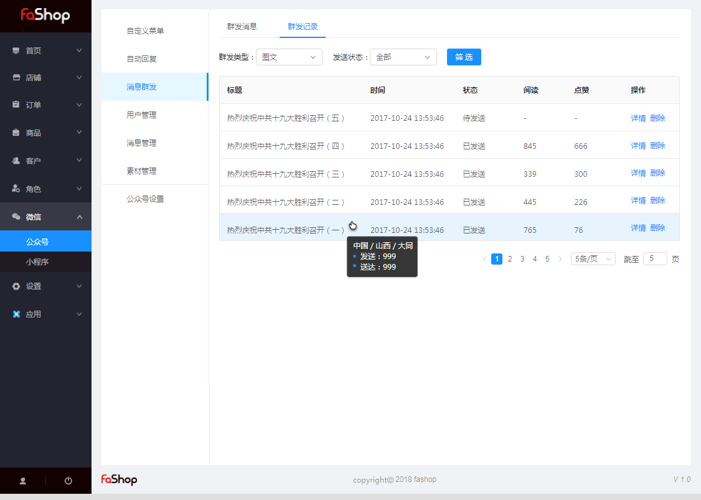

### 公众号

#### 消息群发

##### 群发消息

###### 一、功能说明

群发消息是商家主动向粉丝推送信息、推广店铺的一种有效手段。一般情况下，一次群发能给卖家带来短期内访问量的增长，如果群发内容得当，还可以提高粉丝活跃度和店铺成交。

###### 二、功能路径

Fashop后台 → 微信 → 公众号 → 消息群发 → 群发消息

注：暂不支持指定用户群发；

发送内容形式图下图；

编辑完后，可选择“立即群发”或“预览”或“定时发送”；

###### 三、定时群发

可以选择5分钟后的今、明两天内任意时刻定时群发，成功设置后不支持修改，但在设定的时间之前可取消，取消后不占用群发条数。 

##### 群发记录

根据群发类型和发送状态对群发记录进行筛选。

