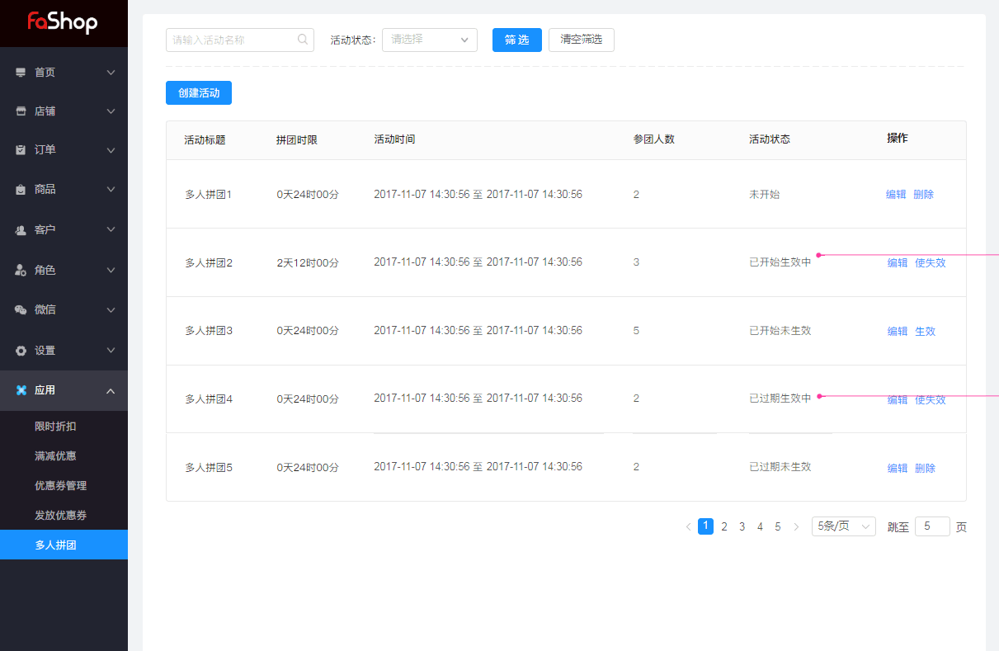
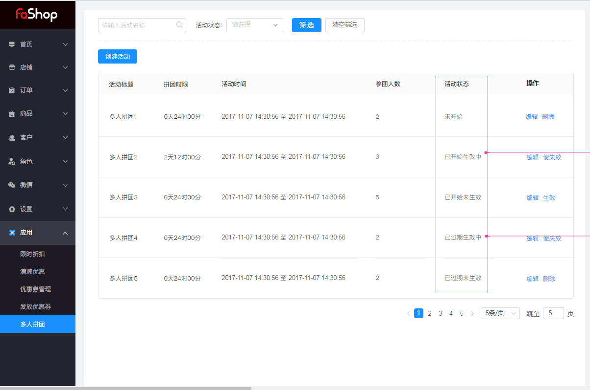
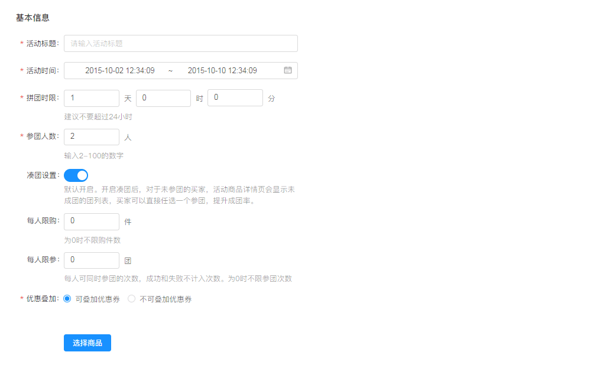
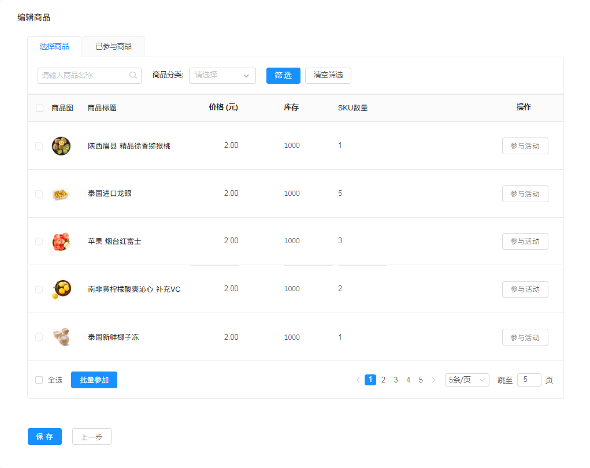
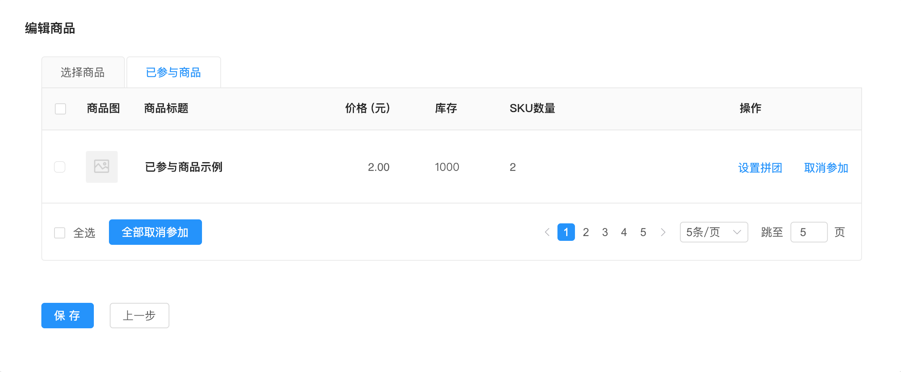
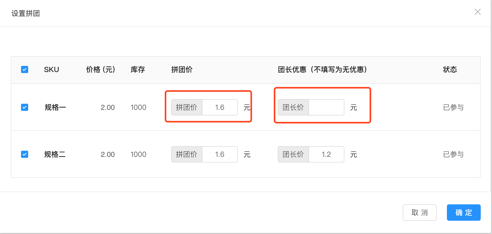
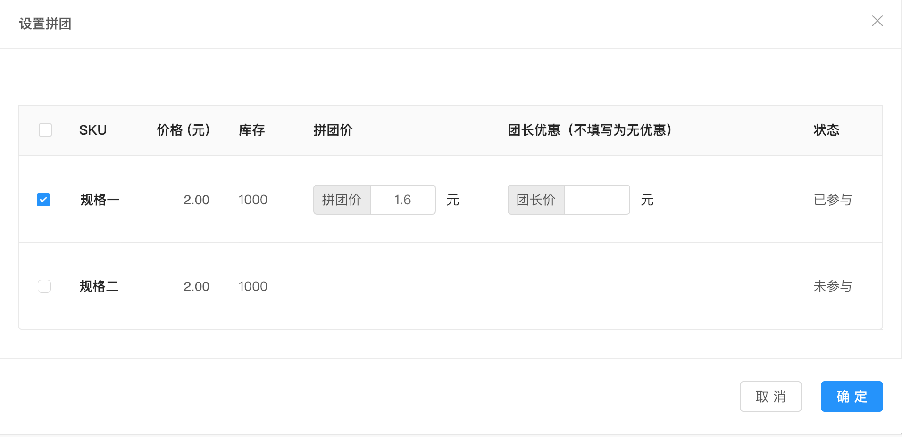
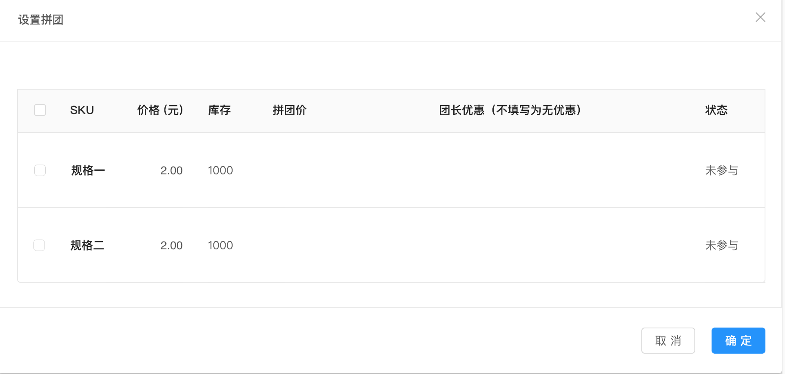

# 应用

#### 多人拼团

筛选活动，通过活动状态进行筛选(未开始、已开始生效中、已开始未生效、已过期生效中、已过期未生效)。

<h6>活动状态：</h6>

未开始：未到活动时间

已开始生效中：已到活动时间自动上线且生效

已开始未生效：已到活动时间上线且生效后，店家主动暂停活动，活动结束前可再次使生效，此状态下不可开团，已开团的分享出去的链接点进来不可参团，商品不在拼团列表中；如果在活动期间内恢复生效后，链接可继续参团，可开团参团。

已过期生效中：超时，不可开团，但可参团，在拼团列表中

已过期未生效：超时，不可开团，不可参团，不在拼团列表

<h6>创建拼团活动，填写活动主要信息。</h6> 

<h6>拼团须知：</h6>

一件商品有多规格，商家设置一批规格在拼团活动中，团长即可在这批规格中随意选一个来开团，团员想跟团长开团的话，也可以购买其他规格，不一定选团长那个规格，都算拼团成功

<h6>凑团排序：</h6>

开启之后商品详情页会显示未成团的列表（20个），排序按照团差的人数越少的越靠前；离团结束时间越近的越靠前；人数的优先于时间。

<h6>限购说明：</h6>

在新建商品的时候，设置了商品限购1件，但是商品参与活动的时候，又设置了限购2件，该场景下：客户最多可以购买3件商品，普通商品1件，活动商品2件

<h6>编辑活动</h6>

注意：

1 商品参与活动后，该商品出现在“已参与”列表，“选择商品”列表不出现

2 当把一个商品的所有sku不参与时，点击确定，则该商品从“已参与”列表移出去

3 默认规格全选，及为商品级，不全选则为sku级

<h6>已参与商品</h6>

已参与商品可以对参与商品进行操作，（设置拼团、取消参加）

<h6>设置拼团</h6>

填写拼团价格，团长优惠价格，已参与可以进行设置价格，未参与不可设计拼团价格。

​	

