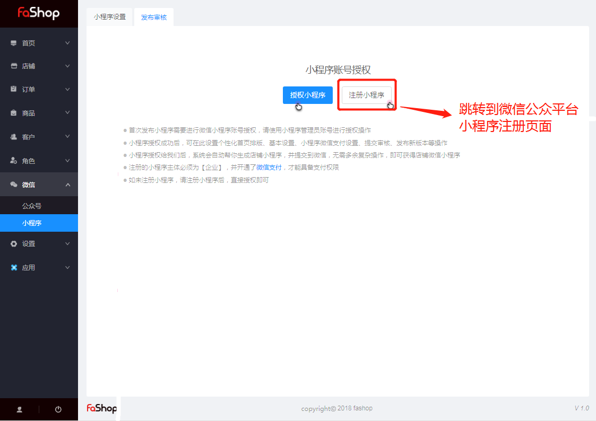

### 小程序

#### 发布授权与审核

##### 一、功能介绍

1. 小程序授权成功后，可在此设置个性化首页排版、基本设置、小程序微信支付设置、提交审核、发布新版本等操作 ；
2. 小程序授权给Fashop后，系统会自动帮你生成店铺小程序，并提交到微信，无需多余复杂操作，即可获得店铺微信小程序 ;
3.  每次功能更新能够自动提交审核，即便审核失败也能一键重新提交审核，省时省力；

注：

1. 首次发布小程序需要进行微信小程序账号授权，请使用小程序管理员账号进行授权操作；
2. 注册的小程序主体必须为【企业】，并开通了微信支付，才能具备支付权限 ；
3. 如未注册小程序，请注册小程序后，直接授权即可 .

##### 二、功能路径

Fashop后台 → 微信 → 小程序 → 发布审核

##### 三、常见问题

1. 一个小程序只能绑定一个店铺

   例：如果「小程序A」已授权到「1号店铺」，用户尝试授权给「2号店铺」时，系统会提示已绑定其他店铺。需要用户先去「1号店铺」的后台解除绑定。

2. 解除授权与重新授权

   商家可以将小程序和店铺解除关联。若要重新授权则授权的是原来关联的小程序，若要授权新的小程序，则需要先接触授权，再绑定新的小程序。

3. 小程序自动更新

   小程序更新时，Fashop会将所有商家的新版本小程序提交给微信进行审核，不需要商家进行任何操作。 但是如果新版本审核如果没有通过微信审核，需要您在Fashop后台重新提交审核。

4. 新版本审核失败会影响老版本吗？

   新版本审核失败，不会影响线上老版本的正常运行。
