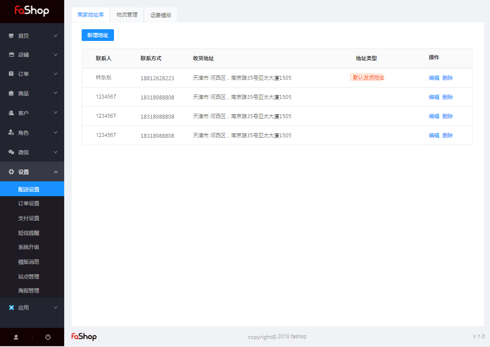
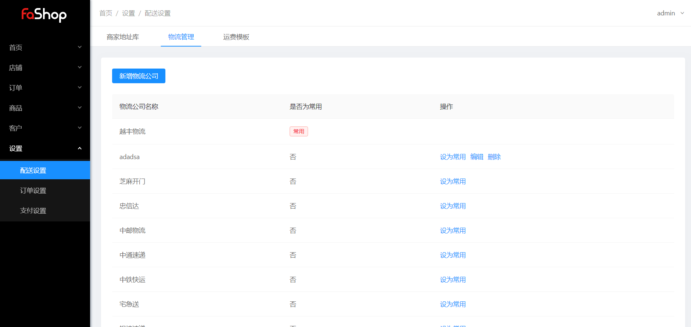
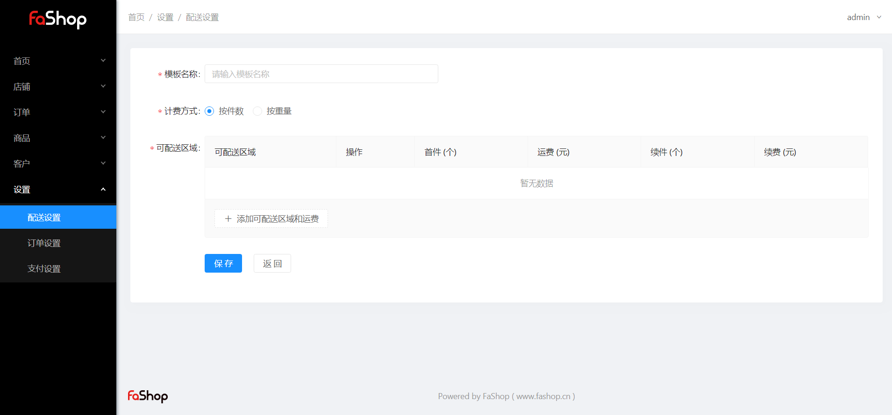

## 设置

### 配送设置

#### 商家地址库

对应操作：新增、编辑、删除、设置为默认地址

商家地址设置的内容：联系人、联系方式、所在区域、详细地址

#### 物流管理

对应操作：新增、编辑、删除、设为常用

物流管理内容：物流公司名称

#### 运费模板

对应操作：新增、编辑、删除

运费模板内容：模板名称、计费方式（按件数、按重量）、可配送区域

######案件数和按重量计费说明

按件数：可设置首件数、收件运费、续件数、续件运费

eg：按照首一件5元，续件2元/件计算，则10件商品运费等于5+2*9=23元

按照首两件5元，续件1元/2件计算，则10件商品运费等于5+4=9元

按重量：可设置首重（kg）、首重运费、续重（kg）、续重运费

eg：按照首重10元/kg，续重2元/kg，则10kg商品运费等于10+2*9=28元

两种计费方式都可以自定义配送区域，配送区域可精确到市。

