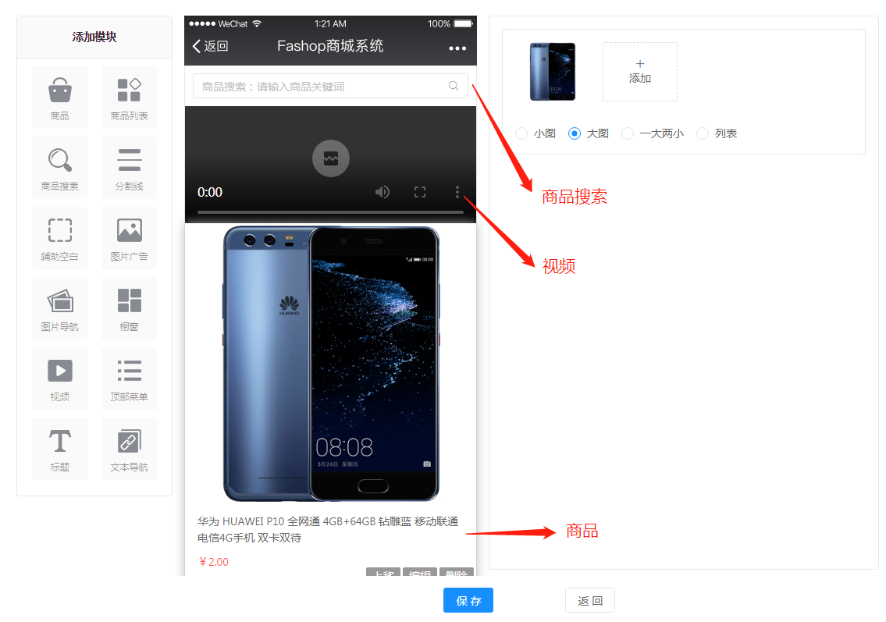

## 店铺

### 店铺装修

#### 店铺主页

##### 一、功能介绍

店铺主页是店铺的门面，好的店铺主页可以吸引粉丝浏览的兴趣，让粉丝快速的找到自己想要买的商品，给粉丝带来良好的购物体验，最终实现高的转化率。 

利用这个功能可以实现模板间的切换，以及自定义模板，根据不同行业不同需求建设自己的店铺，有效提高了建店的效率。除此之外还能获取当前主页的二维码和地址，顾客可以扫码或者根据地址直接浏览微信店铺。

##### 二、模板

系统提供了6个模板供用户选择，用户需要将系统模板克隆至我的模板后即可设为主页。也可对模板进行编辑或者新建模板，模板中有12个基础组件，4个营销组件用户可自行选择并修改其样式。

##### 三、操作流程

路径：Fshop后台→店铺 →店铺装修→店铺主页→我的模板→新增模板

#### 店铺分类页

##### 一、功能介绍

利用这个功能用户可选择不同店铺分类样式，目前有三种样式可选。用户可以扫描页面中的二维码预览该页面。

##### 二、操作流程

路径：Fshop后台→店铺 →店铺装修→店铺分类页

#### 店铺配色

##### 一、功能介绍

在此页面可以选择适合店铺风格的配色。

##### 二、操作流程

路径：Fshop后台→店铺 →店铺装修→店铺配色

### 店铺设置

#### 基本信息

店铺域名、店铺logo（建议尺寸200 x 200 像素小于120KB，支持.jpg、.gif、.png格式 ）、店铺名称、联系电话、店铺简介（微信分享店铺时显示的文案）

