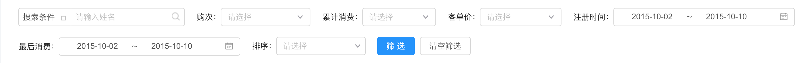
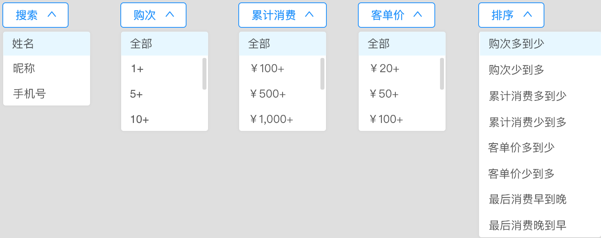
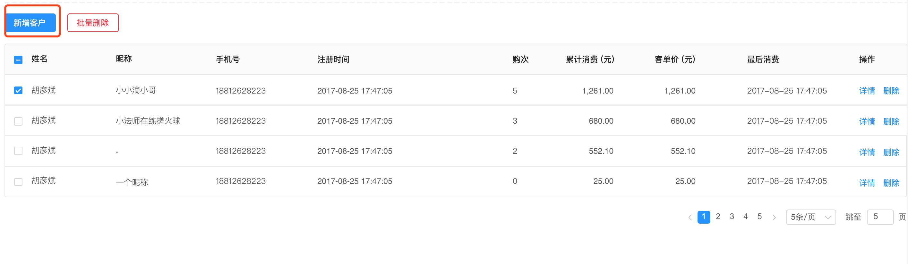
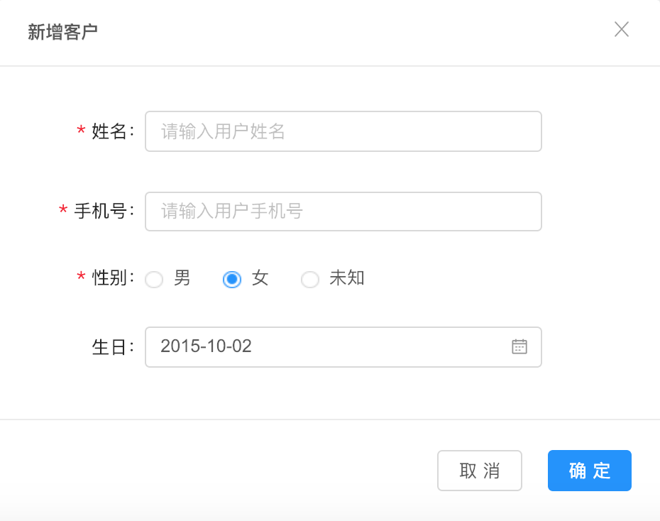
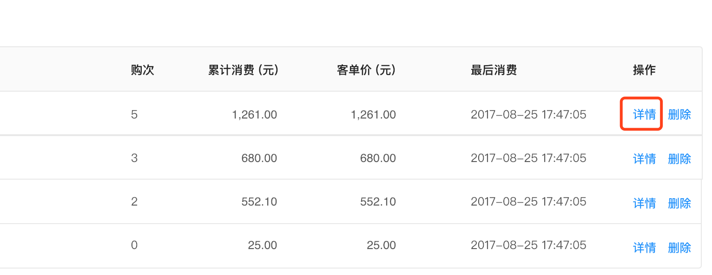
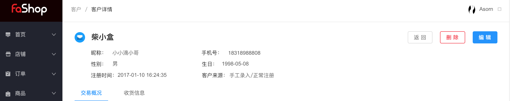
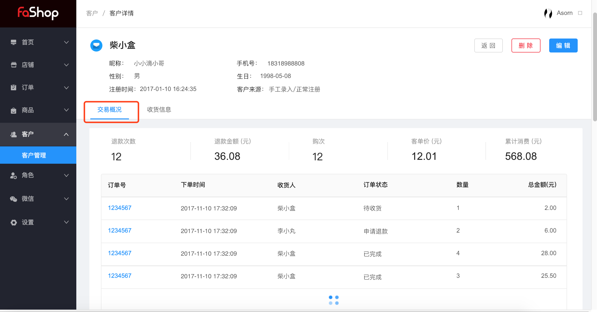
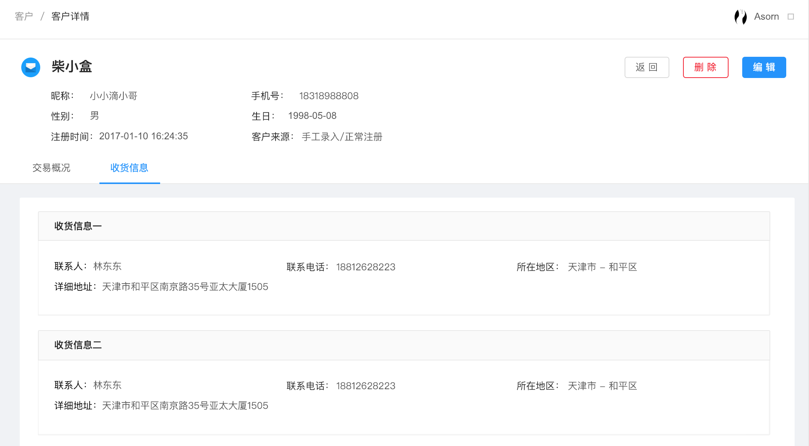

# 用户

#### 用户管理

1、对用户的购买信息搜索，通过搜索条件找到相对应用户信息

如图所示：

2、新增客户，点击新增客户，用户可以自己生成，也可以在后台进行添加。

3、用户详情，可以查看用户的基本的信息。

****

编辑，可以编辑用户的基本信息，删除，删除用户的信息。

4、交易信息，查看退款次数，退款金额，够次，客单价，累计消费。

5、收货信息，通过在前台的添加，后台可以看到所有的收货信息。

