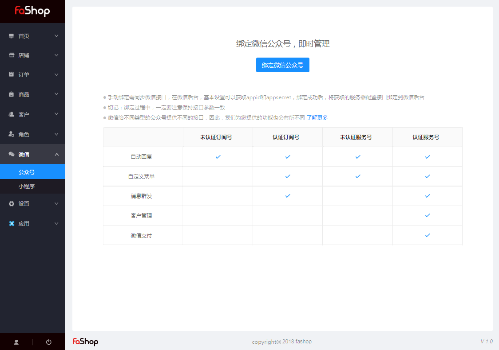

## 微信 

### 公众号管理

####一、绑定微信公众号

手动绑定需同步微信接口，在微信后台，基本设置可以获取appid和appsecret，绑定成功后，将获取的服务器配置接口绑定到微信后台 。绑定过程中，一定要注意保持接口参数一致 。

微信给不同类型的公众号提供不同的接口，因此，我们为您提供的功能也会有所不同。

#### 二、微信授权步骤

路径：Fashop后台→微信→公众号管理 - 绑定微信公众号

步骤：进入公众号登录授权页面，用微信公众号的管理员私人微信扫描二维码→微信扫描二维码成功后，对指定的公众号进行授权→手机端授权成功之后，电脑上的页面状态也随之改变，授权成功 

#### 三、微信授权失败原因

1. 密钥失败错误
2. 已授权给其他微信公众号
3. 已设置，刷新

