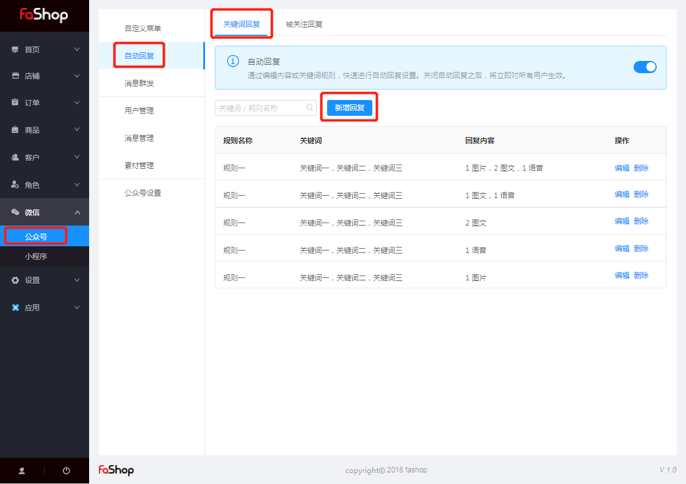
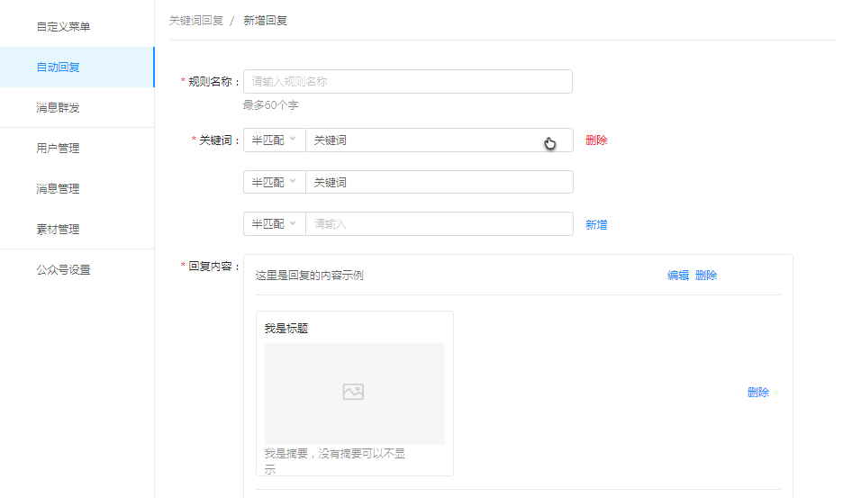
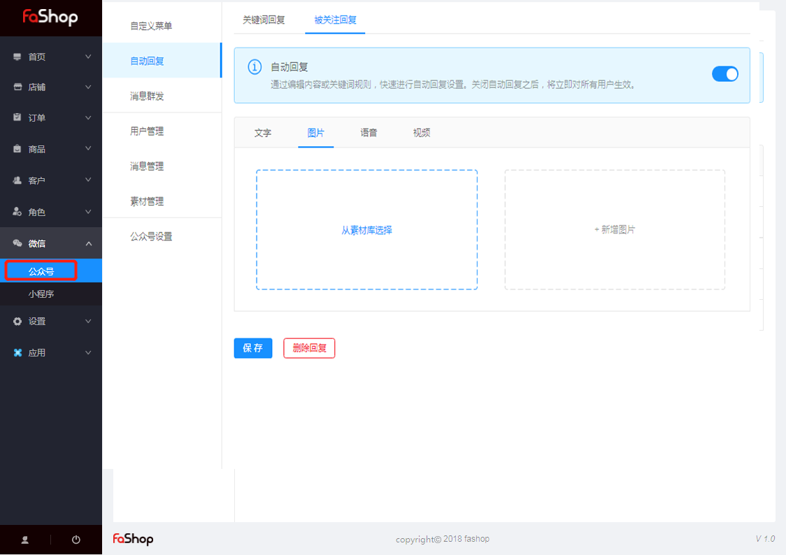

### 公众号

#### 自动回复

##### 关键词回复

###### 一、功能介绍

自动回复，就是当用户关注或者发送一条消息给公众号时，系统会根据商家预先设置好的条件和内容，给用户回复一条消息。这样一方面能减少商家的运营成本，同时也让用户自助、高效的了解更多信息。 

###### 二、功能路经

fashop 后台 → 微信 → 公众号 → 自动回复 

###### 三、新增回复

只要识别到用户的信息是关键词（全匹配）或包含关键词（半匹配），系统就会返回您预先设置的内容，如图文、音频、店铺、活动链接等。

- 如下图，添加关键词自动回复，需要点击“新建回复”并编辑好这个规则的名称；

- 输入关键字，选择全匹配或者半匹配；（注意事项：半匹配选项是假如你设置了ab，用户回复abcd就可以自动回复。）

- 最后编辑好回复内容；关键字可以关联图文、语音、视频等内容

  

#### 被关注回复

用户在首次关注您的公众号时显示的内容，您可以在这里简单介绍您的公众号，编写简单指南引导用户在您的公众号里进行操作。

注：回复的内容可以是文字、图文、语音、视频等内容，如下图；

​        只有认证服务号在关注自动回复里面有图片、语音

#####

