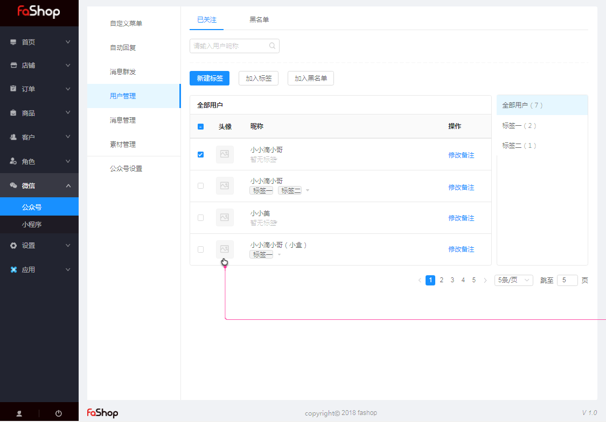

### 公众号

#### 用户管理

此处管理的是公众号粉丝，并非商城客户。可以对公众号粉丝进行分组标签、添加备注以及加入黑名单等操作。

##### 常见问题

###### “客户管理”和微信中的“用户管理”不同步？

客户管理的用户需要用户进店，访问商品，跟店铺签到或是互动、或者下单购买等行为产生后，会在客户管理进行显示的；“微信-用户管理”中的客户是通过关注公众号来的。

###### 公众号后台粉丝和Fashop后台粉丝不一致？

 您可以通过微信公众号重新授权后再看下，如还是无法解决，请联系我们进行排查。 

